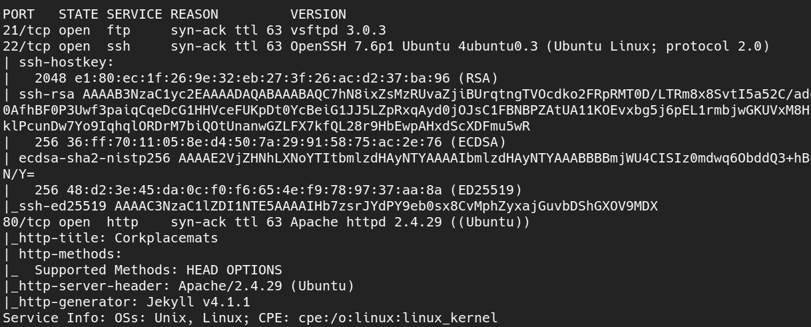
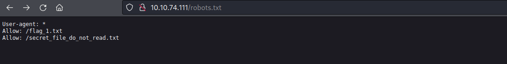
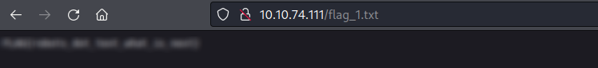
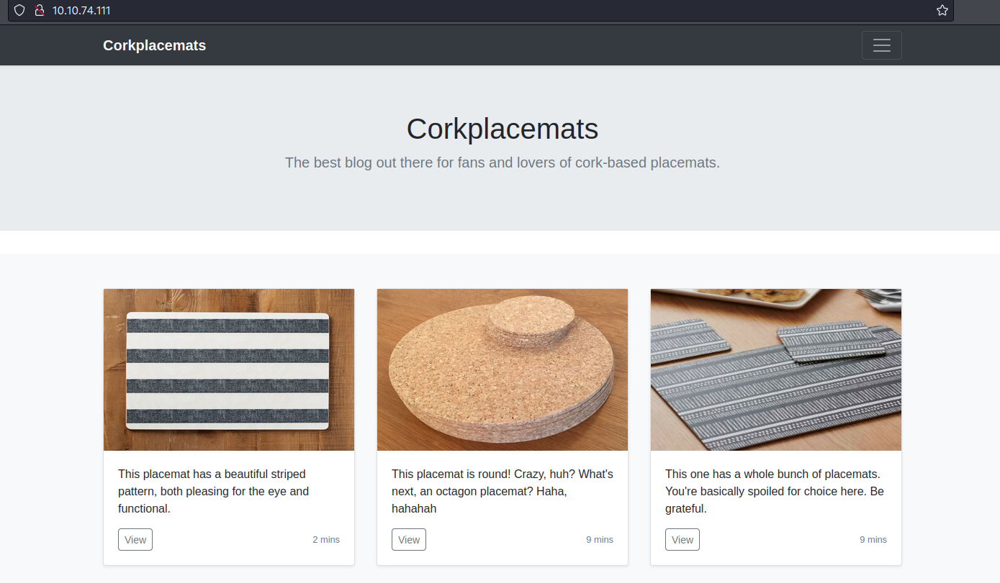
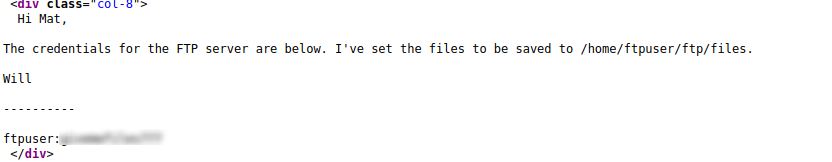
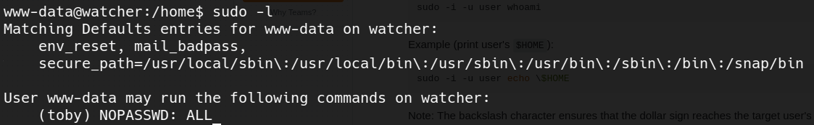
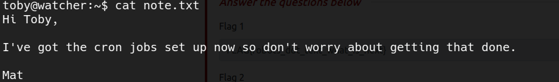
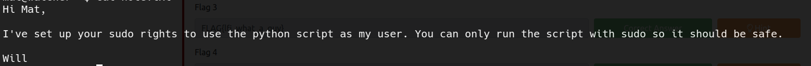
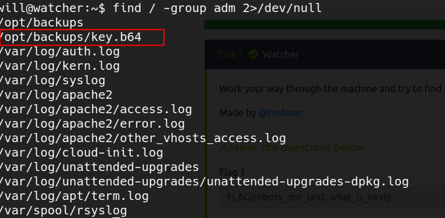
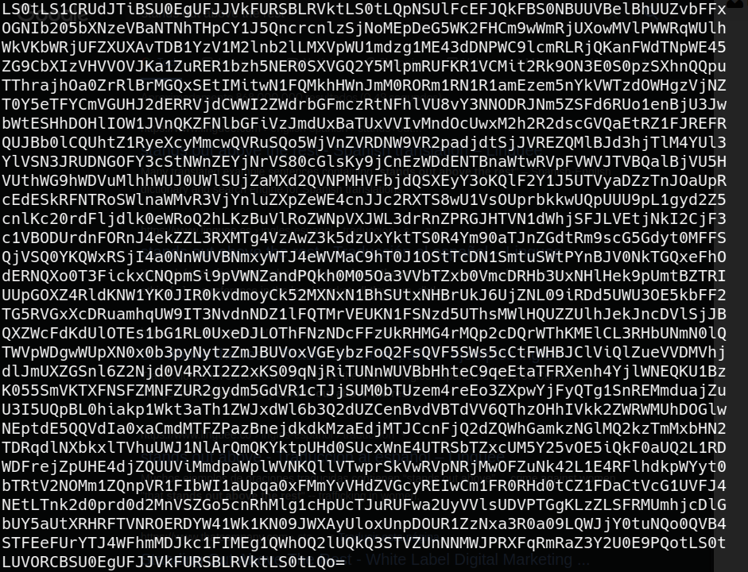

# Watcher Walkthrough (Tryhackme) - by [yag1n3](https://www.github.com/yaguine)

---

## Machine Info

### Room Labels
* Security

### Room Objetives
* Flags 1 to 7

---

## Reconnaissance

### Nmap



### Web Server

let's try first some subdirectory enumeration  
on the endpoint */robots.txt* there are a couple of interesting findings  



we found the **Flag 1** !!!!  



the other endpoint is forbidden, but there might a way to access it  

### Local File Inclusion

on the main page, there are three images  



whenever u click on one of the images, you are sent to an url shaped like this  
`http://<IP>/post.php?post=striped.php`  
after checking, we confirm that it is vulnerable to **LFI**  
we also check that it's not vulnerable to **RFI**  

now we can use this to access the prior endpoint with forbidden access  
we discover the content of the file  



### FTP

first we discover the flag\_2.txt that contains **Flag 2**  
there is also a directory called *files*  
my approach is the following : upload a php reverse shell and access it from the LFI to achieve RCE  

**I spent a lot of time with this, so be aware**  
i wasn't able to upload with the FTP command "put" because i was using an absolute route (e.g put /scripts/phpreverseshell.php)  
THIS DOESN'T WORK !!! you need to be on the directory that contains the file you wanna upload on your local machine  
Example:
1. `lcd /scripts`
1. `put phpreverseshell.php`

now we can access our reverse shell from the LFI and get full access to the machine !!!

---

## Inside the machine

We retrieve our **Flag 3** inside the directory */var/www/html/more_secrets_a9f10a*  

when running `sudo -l`, we see the following :



that means we can use a command like `sudo -u toby /bin/bash` to get a shell as **toby**  

### Shell as Mat

on toby's home directory we discover **Flag 4**  

there is also a file called *note.txt* :



on */etc/crontab*, we see that **mat** is executing */home/toby/jobs/cow.sh*  
since we can modify that script, we introduce a reverse shell payload and access the machine as **mat**  

### Shell as Will

as **mat** we have access to **Flag 5**  
also, there is a note  



the script that we can run as Will is the following  
```python
import os
import sys
from cmd import get_command
   
cmd = get_command(sys.argv[1])

whitelist = ["ls -lah", "id", "cat /etc/passwd"]

if cmd not in whitelist:
        print("Invalid command!")
        exit()

os.system(cmd)
```

but the *get_command* function comes from a file on the same folder called *cmd.py* which we can modify  
so we modify *cmd.py* to look like this  
```python
import os

def get_command(num):
	os.system("/bin/bash")

        return "cat /etc/passwd"
```

now we run `sudo -u will /usr/bin/python3 /home/mat/scripts/will_script.py whatever` and we have a shell as **will**

---

## Shell as root

on will's home directory we can see **Flag 6**  

with the usual enumeration techniques, i find that will is member of the "adm" group  
that's usually a privileged group since we can read files on */var/log*  

after looking for interesting log files, i try searching files on the whole filesystem that belong to "adm"  
`find / -group adm 2>/dev/null`  
there is one that stands out above the rest  



we access it, and we get a random sequence of chars  



looks like base64 !!  

after decoding it, we confirm it's an ssh id\_rsa key  
guess what... it allows us to access the machine by ssh as root

Good Job !!!
